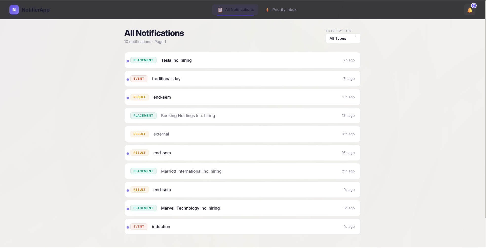
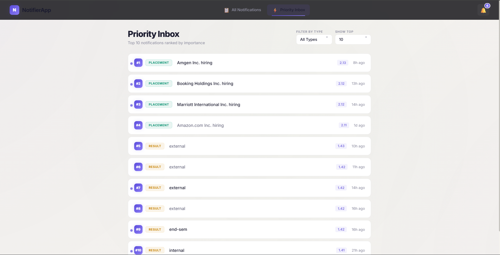
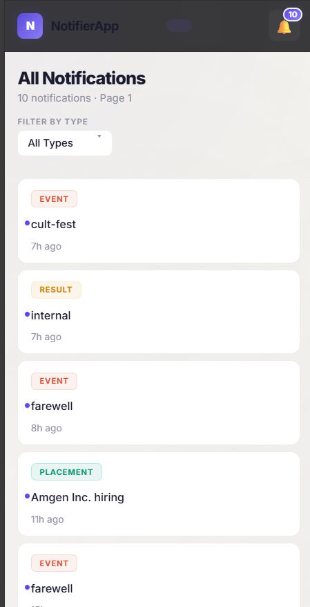
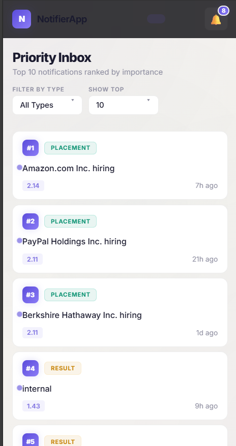

<div align="center">
  
  
  
  
</div>

<h1 align="center">RA2311028010156 - Notification Center</h1>

<p align="center">
  A premium, full-stack notification management system featuring a sleek, responsive UI, an intelligent priority algorithm, and centralized telemetry. Built with modern web technologies to deliver a seamless user experience.
</p>

---

## 🎨 Visual Showcase

Experience the polished, glassmorphism-inspired design crafted for both desktop and mobile environments.

### Desktop Experience
| All Notifications | Priority Inbox |
| :---: | :---: |
|  |  |

### Mobile Experience
| All Notifications | Priority Inbox |
| :---: | :---: |
|  |  |

---

## 🌟 Core Features & Architecture

### 💎 Premium Frontend Experience
- **Tech Stack:** React 18, TypeScript, React Router v6.
- **Design System:** Custom CSS featuring a warm-light glassmorphism theme, smooth micro-animations, and responsive layouts. No generic UI libraries were used for styling, ensuring a unique and tailored aesthetic.
- **State Management:** Persistent read/unread state tracking using `localStorage` and hoisted React state.
- **UX Details:** Dynamic unread badges, custom select dropdowns, rank indicators, and smooth loading skeletons.

### 🧠 Intelligent Priority Algorithm
The backend calculates a dynamic score for each notification, balancing categorical importance and temporal relevance.
- **Weight Allocation:** `Placement` = 3, `Result` = 2, `Event` = 1
- **Recency Decay:** `Recency Score = 1 / (1 + hours_elapsed)`
- **Final Score Calculation:** `(Weight * 0.7) + (Recency Score * 0.3)`

### ⚡ Optimized Data Processing
To efficiently determine the top $N$ notifications from a large dataset $M$ (where $N \ll M$), the system implements a **Bounded Min-Heap of size $N$**.
- **Time Complexity:** $O(M \log N)$ (significantly faster than standard $O(M \log M)$ sorting for large datasets).
- **Space Complexity:** $O(N)$
- Enables highly efficient real-time streaming updates and rapid data serving.

### 📡 Centralized Telemetry
A custom `logging_middleware` library provides structured logging capabilities across the entire stack.
- **Type-safe:** Enforces strict logging levels (`info`, `warn`, `error`, `fatal`).
- **Universal:** Cross-platform support, utilized by both the React Frontend and Express Backend.
- **Performant:** Non-blocking asynchronous execution ensures no impact on main thread performance.

---

## 📁 Project Structure

```text
📦 RA2311028010156
 ┣ 📂 logging_middleware     # Shared TypeScript library for structured logging
 ┣ 📂 notification_app_be    # Express server handling APIs, priority scoring, & logic
 ┣ 📂 notification_app_fe    # React frontend application & custom UI components
 ┣ 📂 screenshots            # Application previews for documentation
 ┗ 📜 README.md              # Project documentation
```

---

## 🚀 Quick Start Guide

### Prerequisites
- Node.js (v16 or higher)
- npm or yarn

### 1. Start the Backend Server
Navigate to the backend directory, install dependencies, and launch the server.
```bash
cd notification_app_be
npm install
npm run dev
```
> **Note:** Ensure you have a `.env` file containing a valid `BEARER_TOKEN` required for upstream API authentication.

### 2. Start the Frontend Application
In a new terminal window, navigate to the frontend directory, install dependencies, and start the development server.
```bash
cd notification_app_fe
npm install
npm start
```

The application will automatically open in your default browser at `http://localhost:3000`.

---
<p align="center">
  Built with ❤️ for a modern web experience.
</p>
